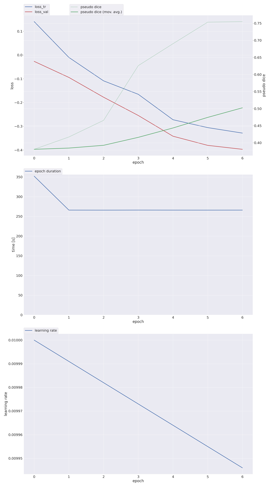
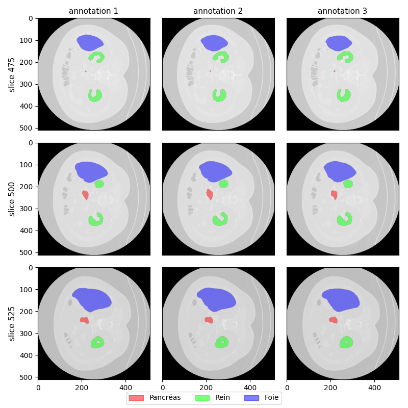
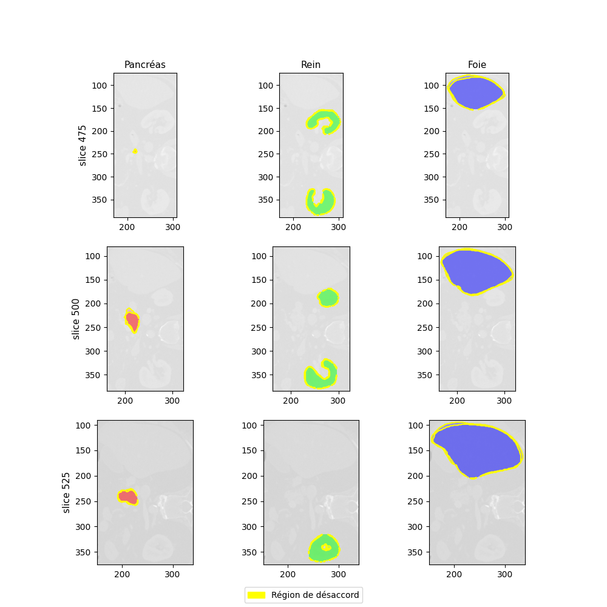
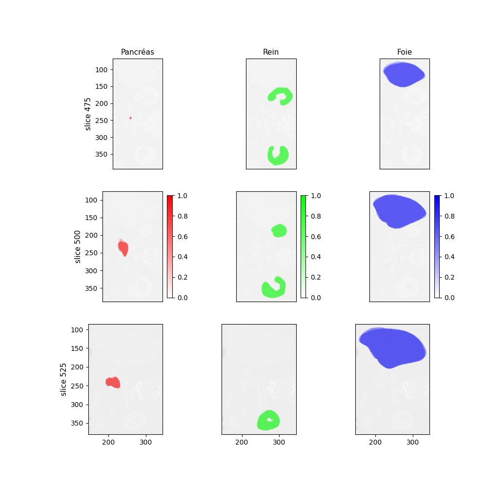

# statapp_2025_curvas

Welcome to the repository for the ENSAE StatApp project!

## Project Overview

**Team Members:**
- Lucas CUMUNEL
- Tara LEROUX
- Léo LEROY
- Rémy SIAHAAN-GENSOLLEN

## Travail jusqu'ici

Le travail jusqu'ici repose principalement sur le fait d'utiliser les 3 annotations pour le même CT scan. 

### Utilisation de la première annotation

Le notebook `datatset_prepreparation_first_anno` contient de quoi préparer un entraînement en utilisant uniquement la première annotation.
J'en ai lancé un sur l'instance Onyxia du SSPCloud, qui malheureusement a crash en cours de route. Le progrès jusqu'ici donne :

Bien que l'entraînement ne soit pas fini, il semble ici que 150 epochs (~4h sur le SSPCloud) sont suffisantes. Il va en revanche falloir
utiliser une installation poussée pour pouvoir reprendre un entraînement arrêté en cours de route (pytorch ne veut pas sinon) et contrôler
la durée des entraînements / changer d'optimiseur (voir également ensuite sur les soft labels).

### Utilisation des trois annotations

Un certain [document](https://zenodo.org/records/10979642) des organisateurs du challenge CURVAS mentionne l'utilisation de soft labels.
J'ai commencé à concevoir un code pour les générer (c'est assez long et lourd en mémoire, il va falloir optimiser ça notamment avec le
garbage collector). De base, nnUNet ne semble pas supporter les soft labels donc il faudra peut-être voir pour modifier si c'est faisable.
Sinon, il faudra tester autre chose ! Il semble qu'ils utilisent surtout ça pour évaluer les soumissions.

